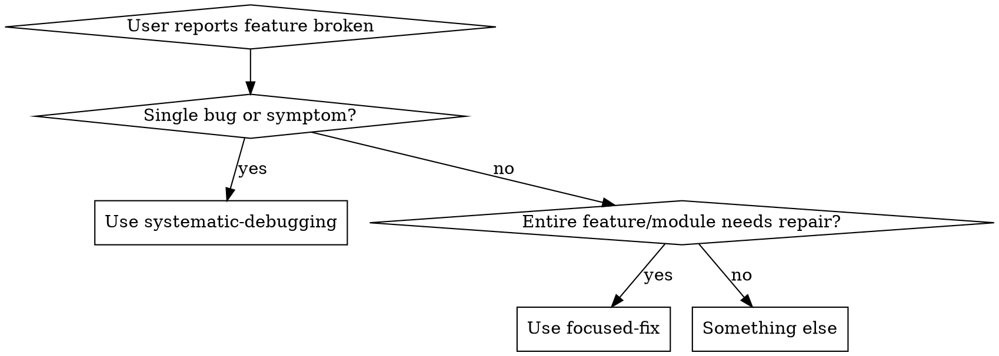

# Focused Fix — Deep-Dive Feature Repair

## When to Use

Activate when the user asks to fix, debug, or make a specific feature/module/area work. Key triggers:
- "make X work"
- "fix the Y feature"
- "the Z module is broken"
- "focus on [area]"
- "this feature needs to work properly"

This is NOT for quick single-bug fixes (use systematic-debugging for that). This is for when an entire feature or module needs systematic repair — tracing every dependency, reading logs, checking tests, mapping the full dependency graph.



## Protocol — STRICTLY follow these 5 phases IN ORDER


### Phase 1: SCOPE — Map the Feature Boundary

Before touching any code, understand the full scope of the feature.

1. Ask the user: "Which feature/folder should I focus on?" if not already clear
2. Identify the PRIMARY folder/files for this feature
3. Map EVERY file in that folder — read each one, understand its purpose
4. Create a feature manifest:

```
FEATURE SCOPE:
  Primary path: src/features/auth/
  Entry points: [files that are imported by other parts of the app]
  Internal files: [files only used within this feature]
  Total files: N
  Total lines: N
```

### Phase 2: TRACE — Map All Dependencies (Inside AND Outside)

Trace every connection this feature has to the rest of the codebase.

**INBOUND (what this feature imports):**
1. For every import statement in every file in the feature folder:
   - Trace it to its source
   - Verify the source file exists
   - Verify the imported entity (function, type, component) exists and is exported
   - Check if the types/signatures match what the feature expects
2. Check for:
   - Environment variables used (grep for process.env, import.meta.env, os.environ, etc.)
   - Config files referenced
   - Database models/schemas used
   - API endpoints called
   - Third-party packages imported

**OUTBOUND (what imports this feature):**
1. Search the entire codebase for imports from this feature folder
2. For each consumer:
   - Verify they're importing entities that actually exist
   - Check if they're using the correct API/interface
   - Note if any consumers are using deprecated patterns

Output format:
```
DEPENDENCY MAP:
  Inbound (this feature depends on):
    src/lib/db.ts → used in auth/repository.ts (getUserById, createUser)
    src/lib/jwt.ts → used in auth/service.ts (signToken, verifyToken)
    @prisma/client → used in auth/repository.ts
    process.env.JWT_SECRET → used in auth/service.ts
    process.env.DATABASE_URL → used via prisma

  Outbound (depends on this feature):
    src/app/api/login/route.ts → imports { login } from auth/service
    src/app/api/register/route.ts → imports { register } from auth/service
    src/middleware.ts → imports { verifyToken } from auth/service

  Env vars required: JWT_SECRET, DATABASE_URL
  Config files: prisma/schema.prisma (User model)
```

### Phase 3: DIAGNOSE — Find Every Issue

Systematically check for problems. Run ALL of these checks:

**CODE QUALITY:**
- [ ] Every import resolves to a real file/export
- [ ] No circular dependencies within the feature
- [ ] Types are consistent across boundaries (no `any` at interfaces)
- [ ] Error handling exists for all async operations
- [ ] No TODO/FIXME/HACK comments indicating known issues

**RUNTIME:**
- [ ] All required environment variables are set (check .env)
- [ ] Database migrations are up to date (if applicable)
- [ ] API endpoints return expected shapes
- [ ] No hardcoded values that should be configurable

**TESTS:**
- [ ] Run ALL tests related to this feature: find them by searching for imports from the feature folder
- [ ] Record every failure with full error output
- [ ] Check test coverage — are there untested code paths?

**LOGS & ERRORS:**
- [ ] Search for any log files, error reports, or Sentry-style error tracking
- [ ] Check git log for recent changes to this feature: `git log --oneline -20 -- <feature-path>`
- [ ] Check if any recent commits might have broken something: `git log --oneline -5 --all -- <files that this feature depends on>`

**CONFIGURATION:**
- [ ] Verify all config files this feature depends on are valid
- [ ] Check for mismatches between development and production configs
- [ ] Verify third-party service credentials are valid (if testable)

Output format:
```
DIAGNOSIS REPORT:
  Issues found: N

  CRITICAL:
    1. [file:line] — description of issue
    2. [file:line] — description of issue

  WARNINGS:
    1. [file:line] — description of issue

  TESTS:
    Ran: N tests
    Passed: N
    Failed: N
    [list each failure with one-line summary]
```

### Phase 4: FIX — Repair Everything Systematically

Fix issues in this EXACT order:

1. **DEPENDENCIES FIRST** — fix broken imports, missing packages, wrong versions
2. **TYPES SECOND** — fix type mismatches at feature boundaries
3. **LOGIC THIRD** — fix actual business logic bugs
4. **TESTS FOURTH** — fix or create tests for each fix
5. **INTEGRATION LAST** — verify the feature works end-to-end with its consumers

Rules:
- Fix ONE issue at a time
- After each fix, run the related test to confirm it works
- If a fix breaks something else, STOP and re-evaluate (go back to DIAGNOSE)
- Keep a running log of every change made
- Never change code outside the feature folder without explicitly stating why

Output after each fix:
```
FIX #1:
  File: auth/service.ts:45
  Issue: signToken called with wrong argument order
  Change: swapped (expiresIn, payload) to (payload, expiresIn)
  Test: auth.test.ts → PASSES
```

### Phase 5: VERIFY — Confirm Everything Works

After all fixes are applied:

1. Run ALL tests in the feature folder — every single one must pass
2. Run ALL tests in files that IMPORT from this feature — must pass
3. Run the full test suite if available — check for regressions
4. If the feature has a UI, describe how to manually verify it
5. Summarize all changes made

Final output:
```
FOCUSED FIX COMPLETE:
  Feature: auth
  Files changed: 4
  Total fixes: 7
  Tests: 23/23 passing
  Regressions: 0

  Changes:
    1. auth/service.ts — fixed token signing argument order
    2. auth/repository.ts — added null check for user lookup
    3. auth/middleware.ts — fixed async error handling
    4. auth/types.ts — aligned UserResponse type with actual DB schema

  Consumers verified:
    - src/app/api/login/route.ts ✅
    - src/app/api/register/route.ts ✅
    - src/middleware.ts ✅
```

## Anti-Patterns — NEVER do these

| Anti-Pattern | Why It's Wrong |
|---|---|
| Starting to fix code before mapping all dependencies | You'll miss root causes and create whack-a-mole fixes |
| Fixing only the file the user mentioned | Related files likely have issues too |
| Ignoring environment variables and configuration | Many "code bugs" are actually config issues |
| Skipping the test run phase | You can't verify fixes without running tests |
| Making changes outside the feature folder without explaining why | Unexpected side effects confuse the user |
| Fixing symptoms in consumer files instead of root cause in feature | Band-aids that break when the next consumer appears |
| Declaring "done" without running verification tests | Untested fixes are unverified fixes |
| Changing the public API without updating all consumers | Breaks everything that depends on the feature |

## Quick Reference

| Phase | Key Action | Output |
|---|---|---|
| SCOPE | Read every file, map entry points | Feature manifest |
| TRACE | Map inbound + outbound dependencies | Dependency map |
| DIAGNOSE | Check code, runtime, tests, logs, config | Diagnosis report |
| FIX | Fix in order: deps → types → logic → tests → integration | Fix log per issue |
| VERIFY | Run all tests, check consumers, summarize | Completion report |
